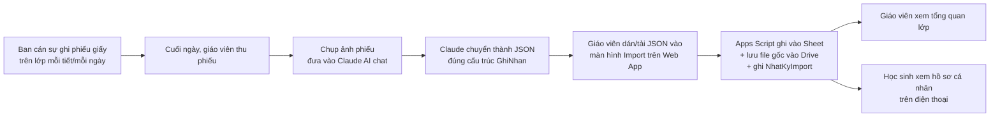

# 00 — Bối cảnh & Tầm nhìn

## 1. Bối cảnh

Anh là giáo viên chủ nhiệm lớp 11. Hiện tại thông tin về sự phát triển của học sinh — học tập, nề nếp, kỷ luật — được ghi nhận thủ công mỗi ngày trên lớp (sổ đầu bài, ghi chép của ban cán sự) nhưng **rời rạc, không chuẩn hoá, khó tổng hợp và dễ thất thoát**.

Mục tiêu là xây dựng một phần mềm web, lấy **học sinh làm trung tâm**, để:

- Mọi ghi nhận hằng ngày (vi phạm, nề nếp, điểm số, xử lý) được lưu vào **một nguồn dữ liệu chuẩn hoá duy nhất**.
- Mỗi học sinh có **một hồ sơ riêng** (link riêng) — xem được toàn bộ quá trình của mình, kể cả trên điện thoại.
- Giáo viên chủ nhiệm có **một màn hình tổng quan** để nắm bắt tình hình lớp nhanh nhất, không bỏ sót học sinh nào.
- Hệ thống **khởi đầu tối giản nhưng có khả năng mở rộng** — không phải làm lại từ đầu khi nhu cầu tăng lên.

## 2. Nguyên tắc thiết kế (áp dụng cho mọi giai đoạn)

| Nguyên tắc | Ý nghĩa thực tế |
|---|---|
| **Học sinh làm trung tâm** | Mọi bảng dữ liệu đều quy chiếu về `ma_hs` (mã học sinh). Giao diện học sinh là công dân hạng nhất, không phải phụ. |
| **Chuẩn hoá dữ liệu trước, giao diện đẹp sau** | Giai đoạn 1 ưu tiên schema đúng và nhập được dữ liệu thật, hơn là giao diện hoàn thiện. |
| **Mobile-first, ưu tiên di động + laptop** | Thiết kế cho màn hình điện thoại trước. **Giai đoạn này ưu tiên kiểm thử kỹ trên di động và laptop** — vì đây là 2 loại thiết bị anh và học sinh dùng nhiều nhất — vẫn responsive tốt trên tablet/desktop nhờ Tailwind, nhưng không phải trọng tâm test đầu tiên. |
| **Đơn giản, bấm nhanh** | Nút bấm to, rõ, ít bước thao tác — đặc biệt cho màn hình nhập liệu của ban cán sự/giáo viên. |
| **Mở rộng không phá vỡ cấu trúc** | Không ràng buộc cứng vào Google Sheets. Xem chi tiết cơ chế ở [tài liệu 01](01-kien-truc-cong-nghe.md#5-cách-mở-rộng-thay-đổi-mà-không-phá-vỡ-cấu-trúc). |
| **AI hỗ trợ chuyển đổi dữ liệu thô, không phải phần mềm** | Việc biến phiếu giấy/sổ đầu bài thành dữ liệu có cấu trúc là công việc của con người + AI chat (Claude), **không** xây tính năng OCR/tự động trong app giai đoạn này. |

## 3. Phạm vi Giai đoạn 1 (What's IN)

1. Google Sheets làm kho dữ liệu chuẩn hoá (xem tài liệu 02).
2. Mẫu phiếu giấy in được để ban cán sự ghi nhận (xem `mau-phieu-ghi-nhan.md`).
3. Web app (Vite + React) deploy lên GitHub Pages, responsive mobile/tablet/desktop.
4. Trang hồ sơ học sinh: thông tin cá nhân, vai trò cán sự lớp (nếu có), lịch sử ghi nhận, điểm thi đua hiện tại, cảnh báo.
5. Trang tổng quan giáo viên: danh sách học sinh, điểm thi đua, cảnh báo học sinh cần chú ý, gợi ý xử lý cơ bản (rule-based).
6. Hệ thống tính điểm thi đua tự động từ dữ liệu ghi nhận — **mỗi học sinh bắt đầu mỗi tuần với 100 điểm cho từng thành phần** (Chuyên cần, Vệ sinh, Nề nếp, Trật tự kỷ luật), cộng thêm Điểm học tập tính riêng, theo đúng quy chế thi đua thật của trường (xem tài liệu 03 — cập nhật từ file quy chế anh cung cấp).
7. Danh sách học sinh **thêm/sửa/xoá được trực tiếp trên web app**, và **nhập nhanh hàng loạt qua Import JSON** (từ Excel nhờ AI chuyển thành JSON) — không cần thao tác tay trên Google Sheet.
8. Màn hình Import chung cho các loại dữ liệu (học sinh, ghi nhận hằng ngày...), tự lưu file gốc + ghi log tra cứu (xem tài liệu 02, Tab `NhatKyImport`).
9. Nút tải mẫu phiếu ghi nhận trực tiếp từ trong web app (không chỉ có file markdown để in thủ công).

## 4. Ngoài phạm vi Giai đoạn 1 (What's OUT — làm sau)

- Tự động OCR/chuyển đổi ảnh phiếu giấy thành dữ liệu (vẫn làm thủ công qua AI chat).
- Đăng nhập/phân quyền đầy đủ (giai đoạn 1 dùng link ẩn danh không đoán được — xem lưu ý bảo mật ở tài liệu 01).
- Thông báo đẩy (push notification) hoặc gọi API SMS cho phụ huynh.
- Gợi ý sư phạm bằng AI thực sự (giai đoạn 1 chỉ là gợi ý theo ngưỡng điểm/quy tắc cố định).
- Di chuyển dữ liệu sang cơ sở dữ liệu thật (Supabase/Postgres/Firebase) — chỉ làm khi Google Sheets không còn đáp ứng đủ.

## 5. Ràng buộc thời gian

- **Thứ Bảy 11/07/2026** (hôm nay): hoàn thành bộ tài liệu này + khởi tạo schema.
- **Thứ Hai 13/07/2026**: bắt buộc có Google Sheet sẵn sàng + phiếu giấy in được, phát cho ban cán sự **ghi nhận ngay trong ngày**. Web app **chưa bắt buộc** phải hoàn thiện vào mốc này.
- **Cuối tuần đó**: web app đọc được dữ liệu từ Sheet, hiển thị hồ sơ học sinh + tổng quan giáo viên cơ bản (xem Nhóm B, C trong tài liệu 04).

## 6. Luồng vận hành thực tế (tuần đầu)

Đây là quy trình **thủ công có trợ lý AI**, không phải pipeline tự động — phù hợp với tốc độ cần có cho tuần sau, và là nền tảng để tự động hoá dần về sau. Điểm khác biệt so với bản trước: **không còn thao tác dán tay vào Google Sheet** — mọi việc ghi dữ liệu đều đi qua nút Import trên web app, để có log và file lưu trữ đầy đủ.
