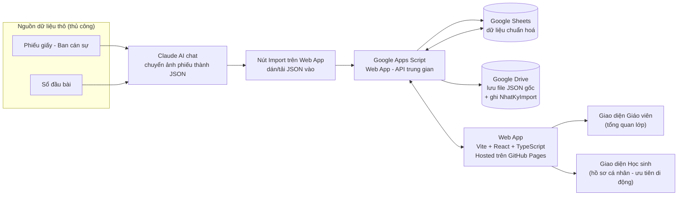

# 01 — Kiến trúc & Công nghệ

## 1. Sơ đồ tổng thể



**Thay đổi quan trọng so với bản trước**: dữ liệu từ Claude **không còn dán tay vào Google Sheet nữa**. Giáo viên dán/tải JSON vào một màn hình **Import** ngay trên web app; app gửi lên Apps Script để tự động ghi vào Sheet, đồng thời lưu file JSON gốc vào Google Drive và ghi 1 dòng log (xem tài liệu 02, Tab 6 `NhatKyImport`).

## 2. Bảng lựa chọn công nghệ & lý do

| Thành phần | Lựa chọn | Vì sao |
|---|---|---|
| **Frontend framework** | Vite + React + TypeScript | Build tĩnh nhanh, xuất ra HTML/JS/CSS thuần → deploy free trên GitHub Pages. TypeScript giúp AI agent (Claude Code/Cursor) sinh code ít lỗi hơn vì có kiểu dữ liệu rõ ràng. Hệ sinh thái lớn nhất hiện nay nên AI agent "biết" React tốt nhất. |
| **CSS** | Tailwind CSS | Viết responsive nhanh bằng class có sẵn, không cần tự viết media query — khớp yêu cầu "nút bấm rõ ràng, dễ bấm" và deadline gấp. **Giai đoạn 1 ưu tiên kiểm thử kỹ trên 2 nhóm màn hình: điện thoại và laptop** (đây là 2 thiết bị dùng nhiều nhất giai đoạn này); tablet/desktop lớn vẫn responsive tốt vì dùng Tailwind, nhưng không phải trọng tâm kiểm thử đầu tiên. |
| **Import dữ liệu** | Màn hình "Import" trong web app (không thao tác trực tiếp trên Google Sheet) | Giáo viên dán/tải file JSON (do Claude tạo ra từ ảnh phiếu, hoặc từ Excel chuyển đổi) → app xem trước → xác nhận → gửi lên Apps Script để ghi vào Sheet. Áp dụng cho cả `HocSinh` (thêm hàng loạt/sửa/xoá) và `GhiNhan` (ghi nhận hằng ngày). |
| **Routing** | React Router (chế độ Hash: `/#/hoc-sinh/abc123`) | GitHub Pages là static hosting thuần, không hỗ trợ rewrite URL phía server. HashRouter chạy đúng ngay cả khi học sinh bấm refresh trang hoặc mở link trực tiếp, không cần cấu hình thêm. |
| **Hosting / CI-CD** | GitHub Actions → GitHub Pages | Miễn phí, public, đúng yêu cầu của anh. Mỗi lần push code, tự động build và publish. |
| **Kho dữ liệu (Giai đoạn 1)** | Google Sheets | Anh đã quen dùng, giáo viên khác có thể xem/sửa trực tiếp khi cần, không tốn chi phí server hay database. |
| **Lớp trung gian đọc/ghi Sheets** | Google Apps Script Web App (`doGet` / `doPost`) | Không thể gọi thẳng Google Sheets API từ web tĩnh một cách an toàn (lộ khoá). Apps Script đóng vai trò một API miễn phí, kiểm soát được trường nào public, trường nào không (ví dụ ẩn số điện thoại). `doPost` còn xử lý **import hàng loạt** (nhiều dòng JSON một lúc), tự lưu file gốc vào Google Drive và ghi 1 dòng vào tab `NhatKyImport`. |
| **Xác thực/định danh học sinh (Giai đoạn 1)** | Link riêng chứa mã token ngẫu nhiên không đoán được (`/#/hs/x7fA9k2Q`) | Chưa cần hệ thống đăng nhập phức tạp cho tuần đầu, nhưng vẫn tránh việc ai cũng đoán được link của bạn khác. Xem mục 6 bên dưới. |

## 3. Vì sao KHÔNG chọn các phương án khác (để tránh đổi ý giữa chừng)

- **Không dùng Firebase/Supabase ngay từ đầu**: tốn thời gian setup, cần thẻ tín dụng/cấu hình, không cần thiết khi dữ liệu còn ít (1 lớp, ~40 học sinh). Sẽ chuyển sang khi cần (xem mục 5).
- **Không dùng Next.js server-side**: GitHub Pages không chạy Node server, phải trả phí hosting khác — không đúng yêu cầu "free, public".
- **Không xây OCR/AI-import tự động trong app**: là bài toán riêng, phức tạp, không cần thiết cho MVP; dùng Claude chat thủ công đã đủ nhanh cho quy mô 1 lớp.

## 4. Cấu trúc thư mục (feature-based, để AI agent dễ định vị công việc)

```
qlhs-web/
├─ src/
│  ├─ data/                     # LỚP TRUNG GIAN DỮ LIỆU — điểm mấu chốt để mở rộng
│  │  ├─ DataSource.ts          # interface chung: getStudents(), addStudent(), updateStudent(),
│  │  │                         #   deleteStudent(), getRecords(), importJson(loai, jsonData)...
│  │  ├─ GoogleSheetsDataSource.ts   # adapter hiện tại (gọi Apps Script API)
│  │  └─ types.ts               # kiểu dữ liệu HocSinh, GhiNhan, DanhMucDiem, NhatKyImport...
│  ├─ features/
│  │  ├─ students/               # danh sách + hồ sơ học sinh
│  │  ├─ records/                 # hiển thị lịch sử ghi nhận
│  │  ├─ scoring/                 # tính điểm rèn luyện 100 điểm
│  │  └─ dashboard/               # tổng quan giáo viên
│  ├─ components/                 # nút bấm, thẻ, layout dùng chung
│  ├─ router.tsx
│  └─ main.tsx
├─ apps-script/
│  └─ Code.gs                    # API trung gian đọc/ghi Google Sheets
└─ docs/                          # chính là bộ tài liệu này
```

## 5. Cách mở rộng/thay đổi mà không phá vỡ cấu trúc

Đây là câu trả lời trực tiếp cho yêu cầu "dễ mở rộng hoặc thay đổi được không":

1. **Đổi kho dữ liệu (Sheets → Postgres/Supabase)**: toàn bộ UI chỉ gọi qua interface `DataSource` (`getStudents()`, `getRecords(maHs)`, `addRecord(record)`...). Khi cần đổi, chỉ viết thêm `SupabaseDataSource.ts` implement đúng interface đó, đổi 1 dòng khởi tạo — **không sửa bất kỳ component giao diện nào**.
2. **Thêm trường dữ liệu mới** (ví dụ thêm "chiều cao/cân nặng" cho học sinh): thêm cột vào Sheet + thêm field vào `types.ts` — không ảnh hưởng các trường cũ, code cũ vẫn chạy vì TypeScript sẽ cảnh báo chỗ nào cần cập nhật.
3. **Thêm tính năng mới** (ví dụ module học tập riêng): tạo thư mục `features/hoc-tap/` mới, không đụng vào các feature khác — vì cấu trúc là feature-based, không phải "một file khổng lồ".
4. **Thêm quy tắc điểm rèn luyện mới**: chỉ cần thêm dòng vào tab `DanhMucDiem` trong Sheet — không cần sửa code, vì logic tính điểm đọc danh mục động (xem tài liệu 03).
5. **Nguyên tắc chung**: mọi thay đổi lớn phải đi qua lớp `data/` hoặc thêm `feature/` mới — không sửa trực tiếp logic hiển thị đã có. Đây là quy tắc bắt buộc với AI agent (xem tài liệu 05).

## 6. Lưu ý bảo mật & quyền riêng tư dữ liệu học sinh (quan trọng)

Vì học sinh là **người chưa đủ 18 tuổi** và dữ liệu bao gồm thông tin nhạy cảm (vi phạm kỷ luật, số điện thoại phụ huynh), cần tuân thủ nghiêm các nguyên tắc sau dù app là public/free:

- **Không hiển thị số điện thoại phụ huynh, họ tên phụ huynh đầy đủ** trên giao diện học sinh public — chỉ hiển thị cho giáo viên (qua giao diện riêng, hoặc trực tiếp trong Sheet).
- **Link hồ sơ học sinh dùng mã token ngẫu nhiên dài** (không dùng số thứ tự 1, 2, 3... dễ đoán), không được đánh index bởi công cụ tìm kiếm (`robots.txt` chặn crawl, thêm thẻ `noindex`).
- **Không công khai danh sách toàn bộ học sinh kèm link** ở bất kỳ trang public nào — mỗi học sinh chỉ nhận được link của chính mình (qua giáo viên phát, ví dụ dán trong nhóm Zalo riêng hoặc QR code cá nhân).
- Nội dung vi phạm hiển thị nên **khách quan, không xúc phạm**, đúng tinh thần giáo dục.
- Về lâu dài, nếu trường có Google Workspace for Education, nên chuyển sang đăng nhập bằng email trường thay vì link ẩn danh — ghi chú việc này như một hạng mục của giai đoạn sau.

## 7. Nguyên tắc bất biến dữ liệu lịch sử (quan trọng — phát hiện từ dữ liệu thật anh cung cấp)

Đối chiếu file điểm danh thật anh gửi (`Diem_danh_11C5...xlsx`), có **bằng chứng thực tế** cho một lỗi thiết kế cần tránh: sheet `11C5` được ghi là *"DANH SÁCH GỐC DUY NHẤT — các sheet điểm danh tự đọc theo đây"*, và đối chiếu với sheet `Backup 11C5` (bản cũ hơn) cho thấy **em Nguyễn Văn Chính (TT 3)** trước đó có `DIỆN = BT`, nay đã đổi thành `DIỆN = 2B`.

**Vấn đề**: nếu các sheet điểm danh theo tuần (Ăn trưa, Ngủ trưa...) **lọc theo `DIỆN` hiện tại** của danh sách gốc (bằng công thức sống/AutoFilter), thì khi đổi diện, các tuần **đã điểm danh xong trước đó** cũng bị tính toán lại theo diện mới — dù tại thời điểm tuần đó, em Chính thực tế đang là diện cũ. Tương tự, nếu sĩ số lớp thay đổi (thêm/bớt học sinh), các thống kê "tổng số lượng" của tuần đã qua cũng có thể bị tính sai nếu công thức không cố định theo đúng danh sách của tuần đó.

**Nguyên tắc bắt buộc cho hệ thống này**: *dữ liệu đã ghi nhận cho một tuần/khoảng thời gian trong quá khứ phải giữ nguyên trạng thái của thời điểm đó, bất kể dữ liệu gốc (hồ sơ học sinh) thay đổi sau này.* Áp dụng cụ thể:

1. **Snapshot tại thời điểm ghi nhận, không tham chiếu sống**: mỗi dòng `GhiNhan` lưu kèm `dien_tai_thoi_diem` (giá trị `DIỆN` của học sinh đúng lúc ghi nhận), thay vì mỗi lần hiển thị lại đi tra cứu `DIỆN` hiện tại từ tab `HocSinh`. Xem tài liệu 02.
2. **Sĩ số/thống kê theo tuần dựa trên ai đang học tuần đó, không phải tổng số hiện tại**: tab `HocSinh` cần thêm `ngay_nhap_hoc` / `ngay_roi_lop` để biết chính xác học sinh nào đang trong lớp ở một tuần cụ thể trong quá khứ — không đơn giản đếm toàn bộ dòng đang có trong Sheet hôm nay. Xem tài liệu 02.
3. **Không dùng công thức Sheet "sống" (live) cho các bảng đã chốt** — nếu sau này mở rộng sang các sheet kiểu điểm danh tương tự, khi 1 tuần đã hoàn tất, danh sách/diện của tuần đó nên được **ghi cứng thành giá trị** (paste values), không giữ công thức tham chiếu tới danh sách gốc — đúng như cách `Cấu hình tuần` trong file anh gửi đã làm rất tốt (mỗi tuần có dòng cấu hình riêng, không ảnh hưởng tuần khác) — tài liệu 02 áp dụng lại đúng mẫu hình `CauHinhTuan` này.

Nguyên tắc này áp dụng cho **mọi trường có thể đổi theo thời gian** trên hồ sơ học sinh: `dien`, `chuc_vu` (ban cán sự), `la_co_do` — không chỉ riêng điểm danh.
