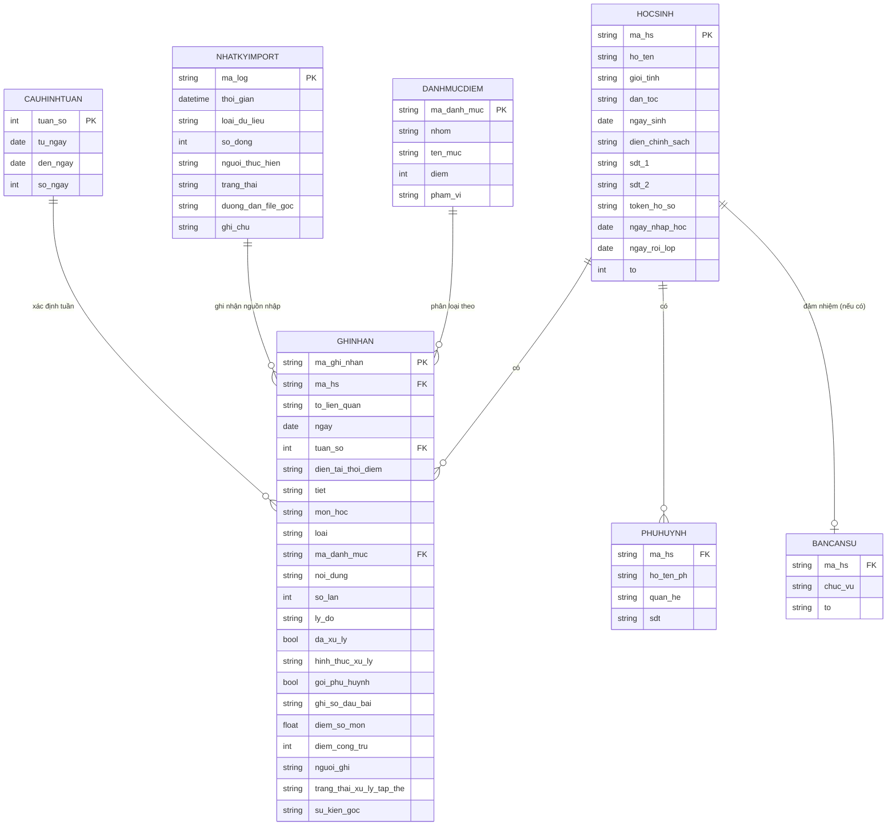

# 02 — Mô hình dữ liệu (Google Sheets)

Một file Google Sheet, tên đề xuất: **`QLHS_11C5_2025-2026`** (đã xác nhận từ dữ liệu thật: Trường THCS & THPT Lạc Hồng, lớp **11C5**, năm học **2025 - 2026**, sĩ số **36**), gồm các tab (bảng) sau. Mỗi tab là một "bảng" trong mô hình quan hệ, quy chiếu về nhau qua `ma_hs` (mã học sinh).

## Sơ đồ quan hệ



## Tab 1: `HocSinh`

Nguồn gốc: danh sách Excel gốc anh cung cấp, giữ nguyên các cột cũ + bổ sung cột kỹ thuật.

| Cột | Kiểu | Ghi chú |
|---|---|---|
| `ma_hs` | text (PK) | Mã tự sinh, ví dụ `HS001`. Không đổi kể cả khi đổi tên. |
| `tt` | number | Số thứ tự gốc từ file Excel (giữ để đối chiếu). |
| `ho` | text | Họ — từ file gốc. |
| `ten` | text | Tên — từ file gốc. |
| `dien` | text | **Đã xác nhận từ dữ liệu thật**: `2B` (2 buổi — không ở lại trường, về nhà buổi trưa) / `BT` (Bán trú — ở lại ăn trưa + ngủ trưa tại trường) / `NT` (Nội trú — ở nội trú tại trường). Không phải "diện chính sách" như suy đoán ban đầu. |
| `nu` | boolean | Nữ (x = có). |
| `dan_toc` | text | |
| `ngay_sinh` | date | |
| `sdt_1` | text | |
| `sdt_2` | text | |
| `ngay_nhap_hoc` | date | Ngày học sinh chính thức vào lớp. Dùng để tính đúng sĩ số/thành phần lớp tại một tuần cụ thể trong quá khứ — xem tài liệu 01 mục 7. |
| `ngay_roi_lop` | date | Để trống nếu vẫn đang học. Nếu học sinh chuyển đi, ghi ngày rời lớp — các tuần trước đó vẫn tính em này vào sĩ số, tuần sau đó thì không. |
| `to` | number | **Sửa sau khi chạy thật**: số tổ (1/2/3) — áp dụng cho **MỌI học sinh**, không chỉ tổ trưởng. Bản trước chỉ lưu `to` trong tab `BanCanSu` cho vai trò Tổ trưởng, thiếu thông tin tổ cho học sinh thường — đây chính là lý do giao diện chưa hiển thị được thông tin tổ. |
| `token_ho_so` | text | Chuỗi ngẫu nhiên dùng làm link riêng, ví dụ `x7fA9k2Q` → `/#/hs/x7fA9k2Q`. |
| `la_co_do` | boolean | Theo quy chế trường: cờ đỏ vi phạm bị trừ điểm **gấp đôi**. Dùng để nhân hệ số khi tính điểm (tài liệu 03 mục 2). |
| `anh_dai_dien` | text (URL) | Tuỳ chọn, để sau. |
| `ghi_chu` | text | Tự do. |

> **Hiển thị vai trò trên hồ sơ học sinh**: giao diện học sinh lấy `chuc_vu` từ tab `BanCanSu` (nếu có dòng khớp `ma_hs`) để hiển thị ví dụ "Lớp trưởng"; nếu học sinh không có trong `BanCanSu`, hiển thị mặc định là "Học sinh".

## Tab 2: `PhuHuynh`

Một học sinh có thể có nhiều dòng (cha, mẹ, người giám hộ).

| Cột | Kiểu | Ghi chú |
|---|---|---|
| `ma_hs` | text (FK) | |
| `ho_ten_ph` | text | |
| `quan_he` | text | Cha / Mẹ / Người giám hộ |
| `sdt` | text | |
| `uu_tien_lien_he` | boolean | Người liên hệ chính khi cần gọi. |

## Tab 3: `BanCanSu`

Ghi nhận vai trò cán sự lớp — dùng làm form chuẩn hoá riêng khi khai báo đầu năm.

| Cột | Kiểu | Ghi chú |
|---|---|---|
| `ma_hs` | text (FK) | |
| `chuc_vu` | text | Lớp trưởng / Lớp phó học tập / Lớp phó kỷ luật / Lớp phó lao động / Thủ quỹ / Tổ trưởng |
| `to` | number | Áp dụng cho Tổ trưởng: 1, 2, hoặc 3 — phải khớp với `HocSinh.to` của chính học sinh đó (tổ trưởng luôn thuộc tổ mình phụ trách). |
| `ngay_bat_dau` | date | |

## Tab 4: `DanhMucDiem`

Danh mục chuẩn hoá các tiêu chí điểm — **lấy nguyên văn từ quy chế thi đua thật của trường** (Trường THCS và THPT Lạc Hồng), chi tiết đầy đủ ở [tài liệu 03](03-he-thong-diem-ren-luyen.md). Đây là **bảng cấu hình động**: thêm/sửa dòng ở đây không cần sửa code (đúng nguyên tắc mở rộng ở tài liệu 01).

| Cột | Kiểu | Ghi chú |
|---|---|---|
| `ma_danh_muc` | text (PK) | Theo quy chế trường, ví dụ `CC01`, `KL09`. |
| `nhom` | text | `CC` (Chuyên cần) / `VS` (Vệ sinh) / `NN` (Nề nếp - Tác phong) / `KL` (Trật tự - Kỷ luật) / `KT` (điểm cộng nội bộ lớp, tuỳ chọn — xem tài liệu 03 mục 6) |
| `ten_muc` | text | Mô tả ngắn, ví dụ "Đi học trễ / 1 trường hợp". |
| `diem` | number | Âm nếu trừ (đa số), dương nếu cộng (chỉ nhóm `KT` tuỳ chọn). |
| `nghiem_trong` | boolean | Đánh dấu các mục trừ 20 điểm (KL06, KL09, KL11, KL12, KL13) — dùng để bật cờ cảnh báo ngay, không chờ tổng kết tuần. |
| `pham_vi` | text | **Quan trọng — mới bổ sung**: `ca_nhan` (gán cho 1 học sinh cụ thể) / `tap_the` (áp dụng cho cả lớp, không gán cho 1 học sinh) / `to_truc` (áp dụng cho tổ trực nhật hôm đó). Xem bảng phân loại đầy đủ ở tài liệu 03 mục 2b. |
| `mo_ta` | text | Mô tả chi tiết/ví dụ áp dụng cho danh mục. Dùng cho các mục có ý nghĩa rộng như "Không thuộc bài": không thuộc 1 từ, 1 ý nhỏ, 1 đoạn, không làm bài... |
| `de_xuat_xu_ly` | text | Gợi ý xử lý/phạt theo số lần lặp lại. Ví dụ: lần 1 nhắc nhở/chép 20 lần cho 1 từ; lần 2 chép 50 lần hoặc đóng quỹ; lần 3 viết kiểm điểm/báo phụ huynh; tái phạm nhiều lần thì mời phụ huynh. |
| `ma_xu_ly_de_xuat` | text (FK) | Mã liên kết sang `DanhMucXuLy.ma_xu_ly`. Dùng để quản lý đề xuất xử lý/phạt bằng mã thay vì chỉ lưu text tự do. |

> **Vì sao cần `pham_vi`?** Đối chiếu kỹ với văn bản quy chế trường, một số tiêu chí ghi rõ "/ tập thể" hoặc "/ 1 lần" (không gắn tên học sinh cụ thể) — ví dụ "Lớp gây mất trật tự... / 1 tập thể", "Bán trú lớp ăn trưa không vệ sinh... / 1 lần". Nếu bắt buộc mọi dòng `GhiNhan` phải có `ma_hs`, những sự kiện này sẽ bị gán khiên cưỡng cho 1 học sinh không liên quan, làm sai lệch điểm cá nhân. Trường `pham_vi` giải quyết việc này — xem chi tiết cách xử lý ở tài liệu 03.

## Tab 5: `DanhMucXuLy`

Danh mục chuẩn hoá các hình thức/gợi ý xử lý/phạt để nhiều danh mục điểm có thể dùng chung một mã xử lý. Nguồn tạo có thể từ giáo viên nhập tay hoặc từ gợi ý AI trong `de_xuat_danh_muc`.

| Cột | Kiểu | Ghi chú |
|---|---|---|
| `ma_xu_ly` | text (PK) | Mã xử lý/phạt, tự sinh dạng `XL01`, `XL02`... |
| `ten_xu_ly` | text | Tên ngắn để chọn trong dropdown, ví dụ "Xử lý: Không thuộc bài". |
| `noi_dung_xu_ly` | text | Nội dung xử lý/phạt chi tiết theo số lần lặp lại. |
| `muc_do` | text | `nhe` / `vua` / `nang` / `tich_cuc`. |
| `ghi_chu` | text | Ghi chú nguồn tạo hoặc ngữ cảnh áp dụng. |

## Tab 6: `CauHinhTuan` (mới — học theo đúng mẫu đã chứng minh hiệu quả trong file điểm danh thật của anh)

File điểm danh anh gửi đã có sẵn 1 sheet `Cấu hình tuần` rất tốt: mỗi dòng là 1 tuần, điền Từ ngày/Đến ngày, và **thêm tuần mới không ảnh hưởng tuần đã điền trước** — đúng tinh thần "mở rộng không phá vỡ cấu trúc" của tài liệu 01. Tài liệu 02 áp dụng lại y nguyên mẫu này thay vì tự đặt ra 1 định dạng tuần khác (`2026-W29`) như bản nháp trước.

| Cột | Kiểu | Ghi chú |
|---|---|---|
| `tuan_so` | number (PK) | Số tuần, tăng dần: 1, 2, 3... |
| `tu_ngay` | date | |
| `den_ngay` | date | |
| `so_ngay` | number | Số ngày học trong tuần (thường 5 hoặc 6). |

Mọi dòng trong `GhiNhan` tham chiếu `tuan_so` (không phải chuỗi tự chế) — khớp thẳng với cách tài liệu 03 tính điểm theo tuần.

## Tab 7: `GhiNhan` (bảng trung tâm — quan trọng nhất)

Mỗi dòng = một lần ghi nhận cho một học sinh, một ngày, một tiết (nếu áp dụng). Đây chính là dữ liệu được chuyển từ phiếu giấy vào.

| Cột | Kiểu | Ghi chú |
|---|---|---|
| `ma_ghi_nhan` | text (PK) | Tự sinh, ví dụ `GN000123`. |
| `ma_hs` | text (FK) | **Để trống nếu là sự kiện tập thể** (`DanhMucDiem.pham_vi = tap_the`) — ví dụ cả lớp ồn giờ chào cờ. |
| `to_lien_quan` | number | Áp dụng khi `pham_vi = to_truc` (ví dụ tổ 2 trực nhật bẩn) — ghi số tổ (1/2/3) thay vì `ma_hs`. Để trống với các trường hợp khác. |
| `ngay` | date | |
| `tuan_so` | number (FK) | Tham chiếu tab `CauHinhTuan` — dùng để tính điểm theo đúng tuần ở tài liệu 03. |
| `dien_tai_thoi_diem` | text | **Mới bổ sung — nguyên tắc bất biến lịch sử (tài liệu 01 mục 7)**: sao chép `HocSinh.dien` tại đúng thời điểm ghi nhận dòng này. Không tra cứu lại `dien` hiện tại của học sinh khi hiển thị báo cáo cũ — tránh lỗi đổi diện làm sai lệch dữ liệu tuần trước, đúng như trường hợp thật của em Nguyễn Văn Chính. |
| `tiet` | text | Tiết 1–5, hoặc "Cả ngày" cho nề nếp tổng quát (đầu tóc, đồng phục). |
| `mon_hoc` | text | Áp dụng khi liên quan tiết học cụ thể. |
| `loai` | text | `chuyen_can` / `ve_sinh` / `ne_nep` / `trat_tu_ky_luat` / `hoc_tap` (chỉ ghi điểm số, không trừ điểm) / `khen_thuong` (tuỳ chọn) — khớp 5 thành phần điểm ở tài liệu 03. |
| `ma_danh_muc` | text (FK) | Tham chiếu tab `DanhMucDiem` — đảm bảo dữ liệu chuẩn hoá, không gõ tự do tràn lan. Bỏ trống nếu `loai = hoc_tap` (không dùng danh mục, chỉ dùng `diem_so_mon`). |
| `noi_dung` | text | Mô tả chi tiết thêm, tự do (ví dụ lý do cụ thể). |
| `so_lan` | number | Số lần vi phạm trong ngày/tiết đó. |
| `ly_do` | text | |
| `da_xu_ly` | boolean | |
| `hinh_thuc_xu_ly` | text | Viết kiểm điểm / Chép phạt / Ưu tiên khảo bài tiết sau / ... |
| `goi_phu_huynh` | boolean | |
| `ghi_so_dau_bai` | text | Nội dung bị ghi trong sổ đầu bài (nếu có). |
| `diem_so_mon` | number | Điểm kiểm tra miệng/15p trong tiết đó (nếu có). |
| `diem_cong_tru` | number | Tự động lấy từ `DanhMucDiem.diem` theo `ma_danh_muc`, có thể ghi đè thủ công nếu cần. |
| `nguoi_ghi` | text | Tên/chức vụ ban cán sự hoặc giáo viên ghi nhận. |
| `nguon` | text | `phieu_giay` / `web` / `nhap_tay` — để biết dữ liệu vào từ đâu, phục vụ đối chiếu. |
| `ma_log_import` | text (FK) | Liên kết tới tab `NhatKyImport` — biết chính xác dòng này được nhập vào qua lần import nào (xem Tab 7 bên dưới). |
| `trang_thai_xu_ly_tap_the` | text | Chỉ áp dụng khi `pham_vi ≠ ca_nhan`: `chua_xu_ly` (mặc định) / `da_gan_ca_nhan` / `da_ap_dung_ca_lop` / `bo_qua`. Rỗng với các dòng cá nhân thông thường. Xem quy trình xử lý ở tài liệu 03 mục 2b. |
| `su_kien_goc` | text (FK, tự tham chiếu `ma_ghi_nhan`) | Chỉ có ở các dòng cá nhân được **tự động sinh ra** từ thao tác "Gán cho 1 học sinh" / "Áp dụng cho tất cả" — trỏ về dòng sự kiện tập thể gốc, để truy vết nguồn gốc vi phạm. |

## Tab 8: `NhatKyImport` (bảng nhật ký chung — mới)

Mỗi lần dùng nút "Import" trên web app (dán/tải JSON lên) sẽ tự động tạo **1 dòng log** ở đây, giúp tra cứu lại lịch sử nhập liệu khi cần, phân loại rõ ràng theo loại dữ liệu.

| Cột | Kiểu | Ghi chú |
|---|---|---|
| `ma_log` | text (PK) | Tự sinh, ví dụ `LOG000045`. |
| `thoi_gian` | datetime | Thời điểm import. |
| `loai_du_lieu` | text | `hoc_sinh` / `ghi_nhan` / `phu_huynh` / `ban_can_su` — phân loại để dễ tra cứu lại. |
| `so_dong` | number | Số dòng dữ liệu được nhập trong lần đó. |
| `nguoi_thuc_hien` | text | Ai bấm import (mặc định là giáo viên trong Giai đoạn 1, chưa có đăng nhập nhiều người). |
| `trang_thai` | text | `thanh_cong` / `loi_mot_phan` / `that_bai`. |
| `duong_dan_file_goc` | text (URL) | Link tới file JSON gốc đã lưu trữ (xem cấu trúc thư mục bên dưới) — để đối chiếu lại nếu dữ liệu trong Sheet có nghi vấn. |
| `ghi_chu` | text | Ví dụ liệt kê dòng lỗi nếu `trang_thai` không phải thành công hoàn toàn. |

### Cấu trúc thư mục lưu trữ file JSON gốc

Vì web app tĩnh (GitHub Pages) không tự ghi file vào git repo lúc chạy, file JSON gốc mỗi lần import được **Google Apps Script lưu vào một thư mục Google Drive riêng của dự án**, tổ chức theo loại dữ liệu và ngày — đây chính là "thư mục cấu trúc dự án" cho phần import:

```
Google Drive/QLHS_11C5_2025-2026/nhat-ky-nhap-lieu/
├─ hoc-sinh/
│  └─ 2026-07-13_143000_HS_import.json
├─ ghi-nhan/
│  ├─ 2026-07-13_180500_GN_import.json
│  └─ 2026-07-14_173000_GN_import.json
├─ phu-huynh/
└─ ban-can-su/
```

- Tên file tự sinh theo mẫu `YYYY-MM-DD_HHmmss_<MaLoai>_import.json`.
- Mỗi file lưu **nguyên văn JSON đã import**, không chỉnh sửa — dùng làm bằng chứng đối chiếu khi cần tra lại.
- `duong_dan_file_goc` trong tab `NhatKyImport` trỏ thẳng tới file tương ứng trong Drive.

## Ghi chú thiết kế quan trọng

- **`ne_nep` (đầu tóc, đồng phục, nói chuyện, vô lễ...) được gộp chung vào bảng `GhiNhan`**, phân biệt bằng cột `loai` và `ma_danh_muc`, thay vì tạo bảng riêng cho từng loại vi phạm — giúp tính tổng điểm rèn luyện đơn giản (chỉ cần SUM một cột `diem_cong_tru` theo `ma_hs`), và dễ mở rộng thêm loại mới chỉ bằng cách thêm dòng trong `DanhMucDiem`.
- **Điểm học tập theo tiết (`diem_so_mon`)** được lưu kèm trong `GhiNhan` để không phải tạo hệ thống sổ điểm riêng ở giai đoạn 1 — nếu sau này cần sổ điểm đầy đủ theo cột điểm miệng/15 phút/1 tiết chuẩn Bộ GD, sẽ tách thành tab `DiemSo` riêng (không ảnh hưởng các tab hiện có).
- **Điểm thi đua không lưu số tĩnh** — cả 5 thành phần (Chuyên cần, Vệ sinh, Nề nếp, Trật tự kỷ luật, Học tập) và Điểm xếp loại thi đua tổng hợp đều được **tính động** từ dữ liệu chi tiết trong `GhiNhan`, theo đúng công thức quy chế trường (xem tài liệu 03). Nhờ vậy không bao giờ bị lệch dữ liệu giữa số tổng và chi tiết, và khi trường đổi công thức chỉ cần sửa 1 chỗ trong code.
- **Import dữ liệu qua giao diện app, không dán tay vào Google Sheet** — quy trình thực tế đã điều chỉnh: ảnh phiếu giấy → Claude chuyển thành JSON → dán/tải JSON vào nút "Import" trên web app → Apps Script ghi vào Sheet + lưu file gốc vào Drive + ghi log (xem Tab 7). Việc này áp dụng cho cả `GhiNhan` lẫn `HocSinh` (thêm học sinh mới hàng loạt từ Excel → JSON → Import).
- **Sự kiện tập thể chờ giáo viên xử lý, không tự động trừ điểm ai** — xem tài liệu 03 mục 2b để biết đầy đủ danh sách mã `tap_the`/`to_truc` và quy trình xử lý qua 3 thao tác nhanh trên dashboard (Gán cho 1 học sinh / Áp dụng cho tất cả / Bỏ qua — tài liệu 04 commit C021a). Chỉ sau khi giáo viên xử lý, hệ thống mới tự sinh các dòng cá nhân (`pham_vi = ca_nhan`, có `su_kien_goc` trỏ về sự kiện gốc) để tính vào điểm.
